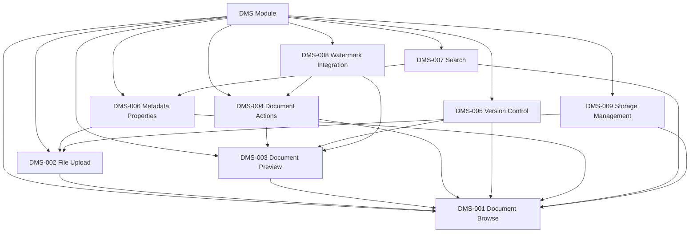

# CORE-002: DMS (Document Management System)

## Marketing Description
Complete document lifecycle: upload, browse, preview, convert, share, and storage management.

## Technical Scope
The DMS module provides foundational document management capabilities across 9 feature areas:

## Features

| Feature | ID | Description |
|---------|-----|-------------|
| [[CORE-002_DMS-001_Document Browse\|Document Browse]] | DMS-001 | Folder tree, file listing, breadcrumbs, drag-drop navigation |
| [[CORE-002_DMS-002_File Upload\|File Upload]] | DMS-002 | Drag-drop, bulk upload, AI-assisted upload, public upload |
| [[CORE-002_DMS-003_Document Preview\|Document Preview]] | DMS-003 | PDF, Office, images, text, video preview with specialized viewers |
| [[CORE-002_DMS-004_Document Actions\|Document Actions]] | DMS-004 | Share, delete, rename, move, copy, download, checkout/hold |
| [[CORE-002_DMS-005_Version Control\|Version Control]] | DMS-005 | Version history, comparison, restoration |
| [[CORE-002_DMS-006_Metadata Properties\|Metadata Properties]] | DMS-006 | Custom fields, document types, properties editing |
| [[CORE-002_DMS-007_Search\|Search]] | DMS-007 | Full-text search, filters, saved searches, smart folders |
| [[CORE-002_DMS-008_Watermark Integration\|Watermark Integration]] | DMS-008 | Text/image watermarks for security and branding |
| [[CORE-002_DMS-009_Storage Management\|Storage Management]] | DMS-009 | Storage backends, quotas, retention, archival |

## Module Dependencies

## Quick Reference

### Key Composables
- `useBrowse.ts` - Browse operations
- `useShare.ts` - Sharing functionality
- `uploadAI.ts` - AI upload features
- `useDnD.ts` - Drag and drop utilities

### Key Components
- `browse/table/table.vue` - Main file listing
- `reader/index.vue` - Document reader
- `browse/Actions/` - All document actions
- `browse/info/index.vue` - Info panel

### Page Modules
- `client-browse/` - Browse and upload
- `client-share/` - Share management
- `client-search/` - Search and smart folders
- `client-ai-upload/` - AI-assisted upload
- `admin-document-type/` - Document type admin

## Completion Checklist
- [x] Upload flow stable
- [x] Preview engine working
- [x] Conversion pipeline
- [x] Storage abstraction