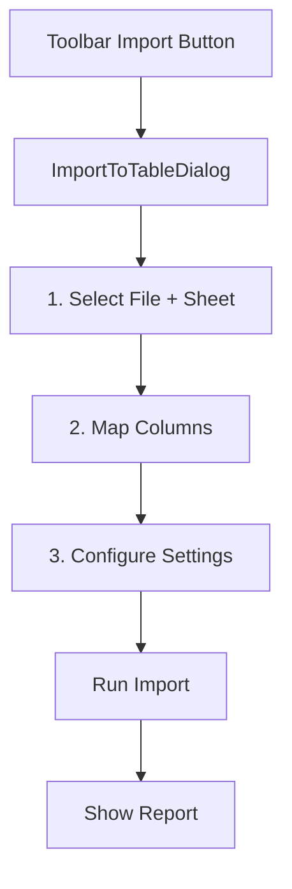

# dp-mdTable Package Architecture

This document provides a comprehensive overview of the `dp-mdTable` package for AI/LLM assistants to understand and work with the codebase effectively.

## Overview

`dp-mdTable` is a dynamic, extensible table component built on top of [vxe-table](https://vxetable.cn/). It provides:

- Dynamic column rendering based on field types
- Relation/Magic Link columns with virtual column support
- Filtering, sorting, grouping capabilities
- Cell-level editing with custom renderers
- Formula columns with expression evaluation

## Package Structure

```
packages/dp-mdTable/
├── components/           # Vue components
│   ├── mdTable/          # Core table components
│   │   ├── index.vue     # Main table component
│   │   ├── Toolbar.vue   # Table toolbar
│   │   ├── header/       # Column header components
│   │   └── addColumn/    # Add/edit column UI
│   └── tools/            # Utility components (filter, sort, grouping)
├── composables/          # Vue composables (core logic)
├── renderers/            # Cell renderer system
├── types/                # TypeScript type definitions
├── utils/                # Helper utilities
└── docs/                 # Documentation
```

## Core Concepts

### 1. Column Field Types

Defined in `types/column-types.ts`:

```typescript
enum ColumnFieldType {
  Text = 19,           // Single-line text
  MultiText = 1,       // Multi-line text
  Number = 2,          // Numeric values
  SingleSelect = 3,    // Single selection dropdown
  MultiSelect = 4,     // Multi-selection dropdown
  DateTime = 5,        // Date/time picker
  Email = 9,           // Email with mailto link
  URL = 8,             // Clickable URL
  Phone = 10,          // Phone number
  Checkbox = 11,       // Boolean checkbox
  Rating = 12,         // Star rating
  Member = 13,         // User/member reference
  MagicLink = 14,      // Relation to another table
  VirtualColumn = 15,  // Derived column from relation
  Formula = 16,        // Computed formula column
  // ... more types
}
```

### 2. ColumnConfig Interface

The core column configuration object:

```typescript
interface ColumnConfig {
  field: string               // Unique field identifier
  title: string               // Display title
  type: ColumnFieldType       // Field type enum
  width?: number | string     // Column width
  properties?: {              // Type-specific settings
    // For Select types:
    options?: SelectOption[]
    // For DateTime:
    dateFormat?: string
    // For Relation (MagicLink):
    relationTableId?: string
    displayFieldNames?: string[]
    // For VirtualColumn:
    sourceRelationField?: string
    displayFieldName?: string
    // ... more per type
  }
}
```

### 3. Relation Columns (MagicLink) vs Virtual Columns

**MagicLink (type 14)**: A relation field that links to another table.
- Stores array of UUIDs referencing related records
- Has `displayFieldNames` - list of fields to fetch from target table
- Renders all display fields combined in one cell
- Has `displayStructure.virtualColumnSettings` - persisted settings for each virtual column

**VirtualColumn (type 15)**: A derived column showing ONE field from a relation.
- Created from an existing MagicLink column
- Shows a single `displayFieldName` as a separate column
- Useful when you need relation data in its own sortable/filterable column
- **Inherits target field's display settings** (colors, formatting, etc.)
- Settings (aggregation, showUniqueOnly) are persisted in parent relation's `displayStructure.virtualColumnSettings`

**Auto-create virtual columns**: When creating a relation with multiple display fields:
- First display field stays in the combined relation column
- Virtual columns are auto-created for all other display fields (2nd, 3rd, etc.)

Example flow:
1. Create relation `rel_company` (MagicLink) with displayFieldNames: `['name', 'email', 'phone']`
2. Virtual columns `rel_company.email` and `rel_company.phone` are auto-created
3. Relation column shows "name", virtual columns show "email" and "phone" separately
4. Virtual columns inherit target field's display settings (e.g., SingleSelect colors)

## Composables Architecture

### Provider/Consumer Pattern

The package uses Vue's `provide/inject` for dependency injection:

```
┌─────────────────────────────────────────────────────────┐
│  Consumer Application (e.g., demo/workspaces)           │
│  ┌───────────────────────────────────────────────────┐  │
│  │  useTableView() - Main Orchestrator               │  │
│  │  ├── useTableFields()   → FieldContextKey         │  │
│  │  ├── useTableViews()    → ViewContextKey          │  │
│  │  ├── useTableColumns()  → ColumnContextKey        │  │
│  │  └── useTableDataProvider() → TableDataContextKey │  │
│  └───────────────────────────────────────────────────┘  │
│                         ↓ provides                      │
│  ┌───────────────────────────────────────────────────┐  │
│  │  dp-mdTable package                               │  │
│  │  ├── useMDTable() - Consumes contexts             │  │
│  │  ├── inject(ColumnContextKey) - Column operations │  │
│  │  └── useTableDataInject() - Data operations      │  │
│  └───────────────────────────────────────────────────┘  │
└─────────────────────────────────────────────────────────┘
```

### Key Composables

#### `useMDTable.ts` (Package Level)
Main table composable that:
- Consumes column and data contexts
- Provides `MdTableContextKey` to child components
- Configures grid options via `useTableConfig`
- Exposes table operations (add/update/delete columns/rows)

#### `types/column-context.ts` (Package Level)
Defines `ColumnContext` interface and `ColumnContextKey`. Consumers inject the context via `inject(ColumnContextKey)`. Column operations:
- `getColumn(field)` - Get column by field name
- `addColumn(column)` - Add new column
- `updateColumn(field, updates)` - Update column settings
- `deleteColumn(field)` - Remove column
- `addVirtualColumn(relationField, displayField)` - Create virtual column

#### Consumer Composables (in demo/workspaces)

These implement the actual data layer and provide contexts:

- **useTableFields**: Manages `CaseFieldRecord` (database schema)
- **useTableViews**: Manages `CaseViewRecord` (display configurations)
- **useTableColumns**: Maps fields → ColumnConfig, handles virtual columns
- **useTableDataProvider**: CRUD operations, relation data fetching

## Renderer System

### How Renderers Work

1. **Registration** (`registry-manager.ts`):
   - `RendererRegistryManager` registers all cell renderers with vxe-table
   - Each renderer has `view` (display) and `edit` (input) modes

2. **Component Mapping** (`render-components.ts`):
   - Maps `ColumnFieldType` → renderer configuration
   - Each type has: `view.render()`, `edit.render()`, `defaultOptions`

3. **Column Configuration** (`getColumnConfig()`):
   - Converts `ColumnFieldType` to vxe-table column config
   - Sets `cellRender` for view mode, `editRender` for edit mode

### Creating a New Renderer

```typescript
// In renderers/components/MyType/view.ts
export const MyTypeView = ({ options, params }: ViewRenderFunctionParams) => {
  const { row, column } = params
  const value = row[column.field]
  return h('div', { class: 'my-type-cell' }, value)
}

export const MyTypeEdit = ({ options, params }: EditRenderFunctionParams) => {
  // Return input component
}

// In renderers/render-components.ts
export const MDTableComponents = {
  MyType: {
    name: 'MyType',
    titleConfig: { icon: 'lucide:my-icon', content: 'My Type' },
    view: { render: MyTypeView, defaultOptions: {} },
    edit: { render: MyTypeEdit, defaultOptions: {} }
  }
}
```

## Component Hierarchy

```
<MDTable>                           # Main table component
├── <Toolbar>                       # Top toolbar (optional)
├── <vxe-grid>                      # vxe-table grid
│   ├── Header Slot                 # Column headers
│   │   └── <header/index.vue>      # Custom header with popover + suggestion badge
│   │       └── <header/popover.vue> # Column context menu
│   ├── Cell Slots                  # Cell content
│   │   └── Renderer (view/edit)    # Type-specific renderer
│   └── Footer Slot                 # Aggregation row
├── <addColumn/popover.vue>         # Add column dialog
│   └── <field/*.vue>               # Type-specific settings
├── <VirtualColumnDialog>           # Add virtual column picker
├── <RecordCardDialog>              # Card preview for relation records
│   └── <CardPreview>               # Renders card with fields
└── <tools/*>                       # Filter/Sort/Group popovers

Consumer Components (demo/workspaces):
├── <TableDetailView>               # Main table view container
│   ├── <ColumnSuggestionPopover>   # Per-column suggestion popover
│   ├── <RelationSuggestionsDialog> # Full suggestions dialog
│   └── <CreateRelationDialog>      # Manual relation creation
```

## Database Schema (for demo/workspaces)

### CaseFieldRecord (case_fields table)
```typescript
interface CaseFieldRecord {
  id: string
  tableId: string
  fieldName: string           // Unique per table (e.g., "company_name")
  fieldNameAlias: string      // Display name (e.g., "Company Name")
  businessType: string        // 'text', 'number', 'relation', etc.
  fieldType: string           // PostgreSQL type
  displayStructure: JSON      // { type: ColumnFieldType, properties: {...} }
  
  // Relation-specific fields:
  relationTableId?: string    // Target table ID
  displayFieldNames?: string[] // Fields to fetch from target table
  lookupFieldId?: string      // Field to match on
}
```

### CaseViewRecord (case_views table)
```typescript
interface CaseViewRecord {
  id: string
  tableId: string
  name: string
  fields: string[]            // Ordered list of visible field names
  filters?: JSON              // Filter configuration
  sorts?: JSON                // Sort configuration
  groups?: JSON               // Grouping configuration
}
```

## Excel Import System

The table supports importing data from Excel/CSV files into an existing table with:
- Multi-sheet handling (user picks one sheet)
- Intelligent column mapping with auto-suggestions
- Lookup-based upsert (update existing or insert new)
- Relation auto-resolution using `lookupFieldId` settings

### Import Flow



### Key Components

1. **ImportToTableDialog.vue**: 3-step wizard dialog
2. **useImportToTable.ts**: Composable with parsing, mapping, and import logic
3. **upsertRows()**: Method in useTableDataProvider for update-or-insert

### Column Mapping

- Auto-suggests mappings based on name similarity
- Excludes non-importable types: relation, virtual column, formula
- User can manually adjust mappings

### Upsert Logic

```typescript
// Select lookup columns to identify existing records
lookupColumns: ['email', 'order_id']

// For each imported row:
// 1. Query existing record by lookup columns
// 2. If found: UPDATE the record
// 3. If not found: INSERT new record
```

### Relation Resolution

During import, relation fields are auto-resolved using their `lookupFieldId`:
1. Get value from the `lookupColumnName` field in the imported row
2. Query target table for matches using `lookupFieldId`
3. If found, populate relation with matched IDs
4. If not found, leave relation empty (logged in report)

## Relation Suggestions System

The table supports automatic relation suggestions that analyze data and suggest potential relations between tables.

### How It Works

1. **Analysis Phase**: When a table is created/imported, `useRelationSuggestions.analyzeTableForRelations()` scans field values
2. **Matching**: Compares values against other tables in the same entity to find matches (>50% match rate)
3. **Storage**: Suggestions stored in `relation_suggestions` table with status: `pending`, `accepted`, `dismissed`
4. **Display**: Column headers show suggestion badges; clicking opens a popover to accept/dismiss

### Column Suggestion Badges

Headers inject `columnSuggestions` context from the consumer:

```typescript
// Provided by TableDetailView
provide('columnSuggestions', {
  getSuggestionCount: (fieldName: string) => number,
  getFieldId: (fieldName: string) => string | null,
  openSuggestionPopover: (fieldName, fieldId, target) => void
})

// Consumed by header/index.vue
const columnSuggestions = inject('columnSuggestions')
const suggestionCount = computed(() => 
  columnSuggestions?.getSuggestionCount(column.field) || 0
)
```

### Suggestion Flow

```
┌─────────────────┐     ┌──────────────────┐     ┌─────────────────┐
│ Column Header   │────▶│ ColumnSuggestion │────▶│ Create Relation │
│ Badge (✨ 2)    │     │ Popover          │     │ (accept)        │
└─────────────────┘     └──────────────────┘     └─────────────────┘
                               │
                               ▼
                        ┌──────────────────┐
                        │ Dismiss          │
                        │ Suggestion       │
                        └──────────────────┘
```

### Key Files

- `demo/workspaces/composables/useRelationSuggestions.ts` - Analysis and CRUD
- `demo/workspaces/components/global/workspaces/ColumnSuggestionPopover.vue` - Per-column popover
- `demo/workspaces/components/global/workspaces/dialogs/RelationSuggestionsDialog.vue` - Full dialog
- `packages/dp-mdTable/components/mdTable/header/index.vue` - Badge display

## Key Patterns

### 1. Field Names in View vs Database

- `view.fields` stores field names (strings), not IDs
- For virtual columns, uses dot notation: `"rel_company.email"`
- This allows the same field to appear multiple ways

### 2. displayFieldNames Array

Relation fields have `displayFieldNames` array:
```typescript
// On CaseFieldRecord
displayFieldNames: ['company_name', 'email', 'phone']
```
This tells the data provider which fields to fetch from the related table.

### 3. Column Properties Mapping

When converting field → column, properties are merged:
```typescript
// In fieldToColumnConfig():
column.properties = {
  ...field.displayStructure?.properties,
  relationTableId: field.relationTableId,
  displayFieldNames: field.displayFieldNames,
  displayField: field.displayFieldNames?.[0]  // Backward compat
}
```

### 4. Virtual Column Updates

Virtual columns persist their settings to the parent relation's `displayStructure.virtualColumnSettings`:
```typescript
// In updateColumn():
if (fieldName.includes('.')) {
  // Virtual column - persist settings to parent relation
  const [relationFieldName, displayFieldName] = fieldName.split('.')
  const relationField = getField(relationFieldName)
  
  // Update displayStructure.virtualColumnSettings[displayFieldName]
  const updatedDisplayStructure = {
    ...relationField.displayStructure,
    virtualColumnSettings: {
      ...relationField.displayStructure.virtualColumnSettings,
      [displayFieldName]: { aggregation, showUniqueOnly, separator, linkToRecord }
    }
  }
  await updateField(relationFieldName, { displayStructure: updatedDisplayStructure })
}
```

### 5. Virtual Column Target Field Rendering

Virtual columns inherit the target field's display settings:
```typescript
// In createVirtualColumnConfig():
const targetField = targetFieldsMap.get(relationField.relationTableId)
  ?.find(f => f.fieldName === displayFieldName)

return {
  type: 15, // VirtualColumn
  properties: {
    // Target field config for rendering (loaded fresh, not persisted)
    targetFieldConfig: {
      type: targetField.displayStructure.type,
      properties: targetField.displayStructure.properties
    },
    // Virtual column settings (persisted)
    aggregation, showUniqueOnly, separator, linkToRecord
  }
}
```

### 6. Record Card Preview on Relation Click

When clicking a relation tag in a cell, a card preview dialog appears showing the related record:

```
┌──────────────────────────────────────────────────────────────┐
│  User clicks relation tag                                     │
│  ↓                                                            │
│  RelationView dispatches 'relation-cell-click' event          │
│  { targetElement, targetTableId, recordId }                   │
│  ↓                                                            │
│  mdTable/index.vue handles event                              │
│  ↓                                                            │
│  RecordCardDialog.open(targetElement, params)                 │
│  ↓                                                            │
│  Fetch in parallel via ColumnContext:                         │
│  - getTableCardConfig(tableId) → formStructure.card           │
│  - getFieldsForTable(tableId) → cached target fields          │
│  - getRecordById(tableId, recordId) → record data             │
│  ↓                                                            │
│  CardPreview renders the card                                 │
└──────────────────────────────────────────────────────────────┘
```

**Key Components:**
- `RecordCardDialog.vue` - UiPopoverDialog wrapper that fetches data and shows CardPreview
- `CardPreview.vue` - Renders card using CardViewConfig
- `relation/view.ts` - Dispatches `relation-cell-click` event on tag click

**ColumnContext Functions for Card Preview:**
```typescript
// Added to ColumnContext interface
getTableCardConfig?: (tableId: string) => Promise<CardViewConfig | null>
getRecordById?: (tableId: string, recordId: string) => Promise<Record<string, any> | null>
```

**Caching Strategy:**
Target table fields and table info are cached in Maps to avoid repeated queries:
```typescript
const targetFieldsCache = new Map<string, CaseFieldRecord[]>()
const targetTableCache = new Map<string, CaseTableRecord>()
```

### 7. Virtual Column Sync on Display Field Changes

When a relation's `displayFieldNames` are modified (add, remove, reorder), virtual columns are automatically synced:

```typescript
// In updateColumn() for relation fields:

// 1. Compare old vs new display fields
const oldVirtualFields = oldDisplayFieldNames.slice(1)  // All except first
const newVirtualFields = newDisplayFieldNames.slice(1)

// 2. Determine virtual columns to add/remove
const virtualColumnsToRemove = oldVirtualFields.filter(name => !newVirtualFields.includes(name))
const virtualColumnsToAdd = newVirtualFields.filter(name => !oldVirtualFields.includes(name))

// 3. Handle first field changes (e.g., reordering moves first field)
if (firstFieldChanged) {
  // Old first field demoted to virtual → add virtual column
  // New first field promoted from virtual → remove virtual column
}

// 4. Update view.fields to sync virtual columns
// 5. Clean up virtualColumnSettings for completely removed fields
```

**Sync behaviors:**
- **Add display field**: Creates virtual column (except for first field)
- **Remove display field**: Removes virtual column + cleans up `virtualColumnSettings`
- **First field changes**: Old first becomes virtual column, new first's virtual column is removed
- **Reorder non-first fields**: No change to virtual columns (they stay in original positions)

### 7. Reactive Arrays and Worker Serialization

When passing arrays through pglite (which uses Workers), convert reactive arrays to plain arrays:
```typescript
// Bad - causes DataCloneError
emit('accepted', { displayFieldNames: formData.displayFieldNames })

// Good - spread to plain array
emit('accepted', { displayFieldNames: [...formData.displayFieldNames] })

// Or use helper
await query('...', [ensurePlainArray(displayFieldNames)])
```

## Record Detail View (WIP)

The detail view provides a dashboard-like widget layout for viewing individual record details. It uses a grid system similar to `dp-dashboard` for drag-and-drop widget configuration.

### Architecture

```
┌─────────────────────────────────────────────────────────────────┐
│  User clicks expand icon in table row                           │
│  ↓                                                              │
│  MdTable emits 'expand-click' event                             │
│  ↓                                                              │
│  TableDetailView calls navigateToRecord(tableId, recordId)      │
│  ↓                                                              │
│  useSingleWorkspace updates workspaceRouteParams                │
│  { detailType: 'record', tableId, recordId }                    │
│  ↓                                                              │
│  detail/index.vue renders LazyWorkspacesDetailRecord            │
│  ↓                                                              │
│  detail/record.vue loads record + renders DetailViewLayout      │
└─────────────────────────────────────────────────────────────────┘
```

### Key Components

| File | Purpose |
|------|---------|
| `utils/detailWidgetHelper.ts` | Widget settings compatible with DashboardWidgetSetting |
| `components/detailView/DetailViewLayout.vue` | Headless grid layout + widget drawer. No header - parent provides edit UI via Teleport |
| `components/detailView/widgets/TableInfo.vue` | Displays selected fields from record |
| `components/detailView/widgets/RelatedTableList.vue` | Shows related records for a relation |

### Headless Pattern

`DetailViewLayout` is a **headless component** that only provides:
- Grid layout using `grid-layout-plus`
- Widget palette (drawer) shown in edit mode
- Drag-and-drop widget positioning

Parent components (e.g., `record.vue`) are responsible for:
- Header, title, navigation (uses existing breadcrumb from workspace)
- Edit/Finish buttons via `<Teleport to="#database-table-header-right">`
- Controlling `editMode` via v-model and handling save

### Phase 1 Widgets

1. **TableInfo** - Display selected fields from the current record
   - Settings: fields to show, layout (grid/list), show labels
   
2. **RelatedTableList** - Show related records for a relation field
   - Settings: relation field, columns to display, page size, allow add/open

### Widget Setting Structure

Follows `DashboardWidgetSetting` pattern for future dashboard integration:

```typescript
interface DetailWidgetSetting {
  x?: number      // Grid x position
  y?: number      // Grid y position
  i?: string      // Unique widget instance ID
  minW?: number   // Min width in grid columns
  minH?: number   // Min height in grid rows
  maxW?: number   // Max width
  maxH?: number   // Max height
  w: number       // Default width
  h: number       // Default height
  component: DetailWidgetType  // 'TableInfo' | 'RelatedTableList'
  setting?: any   // Widget-specific settings
  label: string   // i18n label key
}
```

### Navigation

Uses multi-tab navigation via `useSingleWorkspace`:

```typescript
// Navigate to record detail
navigateToRecord(tableId: string, recordId: string)

// Go back to table view
goBackFromRecord()
```

### Configuration Storage

Detail layout is stored in `case_tables.formStructure.detail`:

```typescript
formStructure: {
  card?: CardViewConfig,
  detail?: {
    widgets: DetailWidgetSetting[]
  }
}
```

### Current Status

- [x] Widget helper with DashboardWidgetSetting structure
- [x] Navigation system (navigateToRecord, goBackFromRecord)
- [x] DetailViewLayout with grid-layout-plus
- [x] TableInfo widget (basic)
- [x] RelatedTableList widget (basic)
- [x] detail/record.vue page component
- [x] Expand click triggers detail view
- [ ] Widget settings dialogs (polish)
- [ ] DetailViewEditor for admin configuration
- [ ] Table settings panel for detail view

## Common Tasks

### Adding a New Column Type

1. Add enum value to `ColumnFieldType` in `types/column-types.ts`
2. Create renderer in `renderers/components/`
3. Register in `renderers/render-components.ts`
4. Add settings component in `components/mdTable/addColumn/field/`
5. Add to `columnBasic.ts` for add-column dropdown
6. Update `registry-manager.ts` width map if needed

### Working with Relations

1. **Create relation**: `createRelationFromColumn(sourceField, targetTableId, targetFieldId, displayFieldNames, name)`
2. **Add virtual column**: `addVirtualColumn(relationFieldName, displayFieldName)`
3. **Update display fields**: Update `displayFieldNames` array on the relation field

### Debugging Tips

- Check `ColumnContextKey` injection for column operations
- Check `TableDataContextKey` for data operations
- Relation data is fetched in `fetchRelationDisplayData()`
- Virtual columns get data from parent relation via `sourceRelationField`

## Files Quick Reference

### Package Files (dp-mdTable)

| File | Purpose |
|------|---------|
| `composables/useMDTable.ts` | Main table composable, provides MdTableContextKey |
| `types/column-context.ts` | Column context types and ColumnContextKey |
| `types/column-types.ts` | ColumnFieldType enum and interfaces |
| `renderers/registry-manager.ts` | Registers renderers with vxe-table |
| `renderers/render-components.ts` | Maps types to renderer configs |
| `renderers/components/VirtualColumn/` | Virtual column renderer |
| `components/mdTable/index.vue` | Main table Vue component |
| `components/mdTable/RecordCardDialog.vue` | Card preview dialog for relation records |
| `components/mdTable/addColumn/popover.vue` | Add/edit column dialog |
| `components/mdTable/addColumn/VirtualColumnDialog.vue` | Virtual column picker dialog |
| `components/mdTable/addColumn/field/Relation.vue` | Relation column settings (multi-select display fields) |
| `components/mdTable/addColumn/field/VirtualColumn.vue` | Virtual column settings |
| `components/mdTable/header/index.vue` | Column header with suggestion badge |
| `components/mdTable/header/popover.vue` | Column header context menu |
| `utils/detailWidgetHelper.ts` | Detail view widget settings and helpers |
| `components/detailView/DetailViewLayout.vue` | Grid layout for record detail view |
| `components/detailView/widgets/TableInfo.vue` | Widget to display record fields |
| `components/detailView/widgets/RelatedTableList.vue` | Widget to show related records |

### Consumer Files (demo/workspaces)

| File | Purpose |
|------|---------|
| `composables/useSingleWorkspace.ts` | Workspace navigation including navigateToRecord |
| `components/global/workspaces/detail/record.vue` | Record detail view page. Uses Teleport for edit buttons |
| `components/global/workspaces/detail/index.vue` | Detail container with `#database-table-header-right` teleport target |
| `composables/useTableView.ts` | Main orchestrator, combines all composables |
| `composables/useTableColumns.ts` | Field→Column mapping, virtual columns |
| `composables/useTableDataProvider.ts` | Data CRUD, relation resolution, upsertRows |
| `composables/useRelationSuggestions.ts` | Relation analysis and suggestion management |
| `composables/useImportToTable.ts` | Excel import with column mapping and upsert |
| `components/workspaces/table/TableDetailView.vue` | Table container, provides columnSuggestions context |
| `components/global/workspaces/ColumnSuggestionPopover.vue` | Per-column suggestion popover |
| `components/global/workspaces/dialogs/RelationSuggestionsDialog.vue` | Full suggestions dialog |
| `components/global/workspaces/dialogs/CreateRelationDialog.vue` | Manual relation creation |
| `components/global/workspaces/dialogs/ImportToTableDialog.vue` | Excel import wizard dialog |
