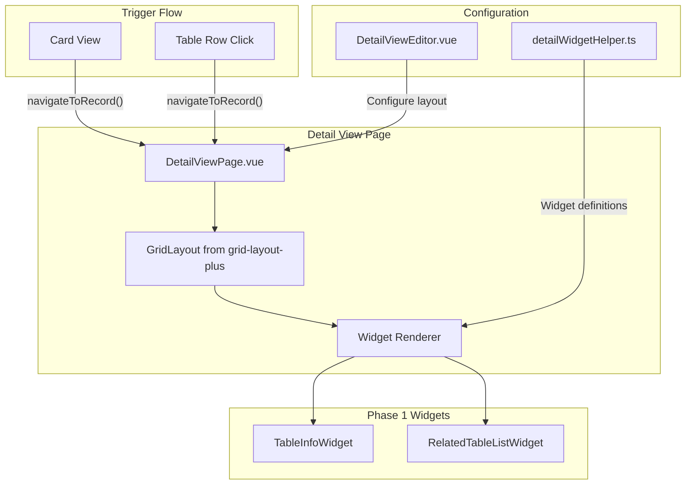

# mdTable Detail View Implementation Plan

> **Status**: Phase 1 Complete (as of Jan 26, 2026)

## Implementation Status

| Task | Status |
|------|--------|
| Create detailWidgetHelper.ts with DashboardWidgetSetting-compatible structure | Completed |
| Create TableInfo widget component with field display and settings | Completed |
| Create RelatedTableList widget component with mini-table and settings | Completed |
| Create DetailViewLayout.vue with grid-layout-plus integration | Completed |
| Create DetailViewEditor.vue for admin configuration | Cancelled (future) |
| Extend useSingleWorkspace with navigateToRecord and 'record' detailType | Completed |
| Create detail/record.vue component for record detail view | Completed |
| Add detail view tab to table settings panel | Cancelled (future) |
| Connect expand-click event to navigate to detail view | Completed |

## Architecture Overview



## Key Design Decisions

- **Reuse `DashboardWidgetSetting` structure** from `dp-dashboard/utils/dashboardWidgetHelper.ts` so widgets can migrate to dashboard later
- **Multi-tab navigation** via `useSingleWorkspace` composable (not Vue Router)
- **Editor pattern** follows existing `CardViewEditor.vue`

## Files Created

### 1. Widget Helper (following dashboard pattern)

**`packages/dp-mdTable/utils/detailWidgetHelper.ts`**

```typescript
// Same structure as dashboardWidgetHelper.ts
export type DetailWidgetType = 'TableInfo' | 'RelatedTableList'

export interface DetailWidgetSetting {
  x?: number
  y?: number
  i?: string
  minW?: number
  minH?: number
  maxW?: number
  maxH?: number
  w: number
  h: number
  component: DetailWidgetType
  setting?: any
  label: string
}

export const detailWidgetSettings: Record<string, DetailWidgetSetting> = {
  TableInfo: {
    label: 'TableInfo',
    minW: 4, minH: 3,
    maxW: 12, maxH: 8,
    w: 6, h: 4,
    component: 'TableInfo',
    setting: { fields: [] }  // Which fields to display
  },
  RelatedTableList: {
    label: 'RelatedTableList',
    minW: 4, minH: 3,
    maxW: 12, maxH: 8,
    w: 6, h: 4,
    component: 'RelatedTableList',
    setting: { relationFieldId: '' }  // Which relation to show
  }
}
```

### 2. Widget Components

**`packages/dp-mdTable/components/detailView/widgets/TableInfo.vue`**

- Displays configured fields from the current record
- Uses existing cell renderers for consistent display
- Settings: select which fields to show, layout (list vs grid)

**`packages/dp-mdTable/components/detailView/widgets/RelatedTableList.vue`**

- Shows related records for a specific relation field
- Reuses existing vxe-table mini-table component
- Settings: select relation field, columns to display, page size

### 3. Detail View Components

**`packages/dp-mdTable/components/detailView/DetailViewLayout.vue`**

- Grid layout using `grid-layout-plus` (same as dashboard)
- Renders widgets based on `DetailViewConfig.widgets`
- Handles edit mode toggle for admin configuration

### 4. Demo Workspaces Integration

**`demo/workspaces/components/global/workspaces/detail/record.vue`**

- Record detail view component (loaded via multi-tab navigation)
- Gets `tableId` and `recordId` from `workspaceRouteParams`
- Fetches record data and table's `formStructure.detail` config
- Renders `DetailViewLayout` with widgets

## Phase 1 Widget Specifications

### TableInfo Widget

- **Purpose**: Display selected fields from the current record
- **Setting options**:
  - `fields: string[]` - Field names to display
  - `layout: 'list' | 'grid'` - Display style
  - `showLabels: boolean` - Show field labels
- **Renders**: Field label + value using existing renderers

### RelatedTableList Widget

- **Purpose**: Show related records for a MagicLink/Relation field
- **Setting options**:
  - `relationFieldId: string` - Which relation field
  - `displayColumns: string[]` - Columns to show from related table
  - `pageSize: number` - Records per page (default: 5)
  - `allowAdd: boolean` - Show add button
- **Renders**: Mini vxe-table with pagination

## Navigation System (Multi-Tab View)

DocPal uses a multi-tab view system instead of Vue Router. Navigation is managed through `useSingleWorkspace` composable.

### Extend WorkspaceRouteParams

In `demo/workspaces/composables/useSingleWorkspace.ts`:

```typescript
export type WorkspaceRouteParams = {
  detailId: string | null
  pageType: "setting" | "detail"
  detailType: 'folder' | 'table' | 'view' | 'dashboard' | 'root' | 'record'  // Add 'record'
  // New: for record detail view
  recordId?: string | null
  tableId?: string | null  // Which table the record belongs to
}
```

### Add navigateToRecord Function

```typescript
function navigateToRecord(tableId: string, recordId: string) {
  workspaceRouteParams.value.detailType = 'record'
  workspaceRouteParams.value.tableId = tableId
  workspaceRouteParams.value.recordId = recordId
  workspaceRouteParams.value.pageType = 'detail'
}
```

### Wiring Expand Click

MdTable emits `expand-click` event when the expand icon in the checkbox column is clicked. TableDetailView handles this to navigate:

```typescript
// In MdTable/index.vue - emits expand-click with row data
const handleExpandClick = (row: any) => {
  const rowIndex = tableData.value.findIndex((r: any) => r.id === row.id)
  emit('expand-click', { row, rowIndex })
}

// In TableDetailView.vue - handles event and navigates
const { navigateToRecord } = useSingleWorkspaceContext()

function handleExpandClick(params: { row: any; rowIndex: number }) {
  const { row } = params
  if (row?.id && props.dataTableId) {
    navigateToRecord(props.dataTableId, row.id)
  }
}
```

## Future Work (Phase 2+)

- [ ] DetailViewEditor.vue for admin configuration UI
- [ ] Add detail view tab to table settings panel
- [ ] Polish widget settings dialogs
- [ ] Additional widgets (timeline, attachments, comments, etc.)
- [ ] Migrate widgets to main dashboard system
