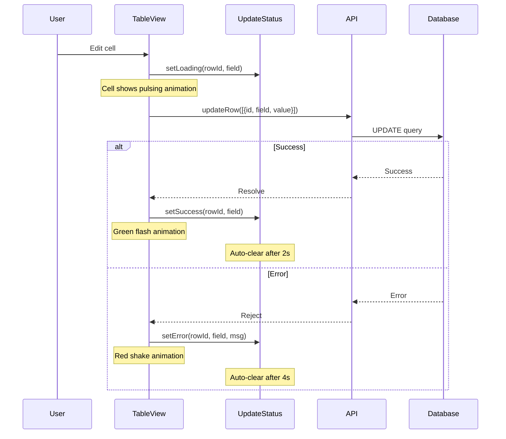

# Update Feedback Implementation Summary

## Overview

Implemented a comprehensive visual feedback system for data updates that works across multiple view types (Table, Kanban, Gantt, Calendar, etc.).

## Problem Statement

After editing a cell in the table (or any view), there was no visual indication that:
- The data was being saved (loading state)
- The save was successful
- The save failed

This led to poor user experience as users couldn't tell if their changes were persisted.

## Solution Architecture

### Centralized State Management

Created a **view-agnostic** composable (`useUpdateStatus`) that tracks update statuses centrally:

```
┌─────────────────────────────────────┐
│     useUpdateStatus                 │
│  (Centralized State)                │
│  - Loading                          │
│  - Success (auto-clears 2s)         │
│  - Error (auto-clears 4s)           │
└─────────────────────────────────────┘
          ↓         ↓         ↓
    ┌─────┴──┐  ┌───┴───┐  ┌─┴─────┐
    │ Table  │  │Kanban │  │ Gantt │
    │  View  │  │ View  │  │ View  │
    └────────┘  └───────┘  └───────┘
```

### Benefits

1. **View-Agnostic**: Data layer is centralized, each view implements appropriate UI
2. **Consistent**: Same API across all view types
3. **Automatic Cleanup**: Success/error states auto-clear to avoid clutter
4. **Flexible**: Each view can render feedback differently (animations, icons, etc.)
5. **Type-Safe**: Full TypeScript support with proper types

## Files Created

### 1. `/composables/useUpdateStatus.ts`
Core composable that manages update statuses.

**Key Features:**
- Tracks loading/success/error states per cell or row
- Auto-clears success (2s) and error (4s) states
- Provides helper functions: `setLoading`, `setSuccess`, `setError`
- Query functions: `isLoading`, `isSuccess`, `isError`
- CSS class helper: `getCellClass(rowId, field)`

### 2. `/composables/index.ts`
Export file for easy importing of composables.

### 3. `/docs/UPDATE_STATUS_GUIDE.md`
Comprehensive guide with examples for implementing in different view types:
- Table view (already implemented)
- Kanban view (example)
- Gantt view (example)
- Calendar view (example)

## Files Modified

### 1. `/components/mdTable/index.vue`

**Changes:**
- Imported `useUpdateStatus` composable
- Updated `edit-closed` event handler to use async/await
- Added status tracking: `setLoading` → update → `setSuccess/setError`
- Added CSS animations for three states:
  - **Loading**: Blue pulsing overlay
  - **Success**: Green flash animation with success dot
  - **Error**: Red shake animation with error background

**CSS Animations:**
```css
.cell-update-loading  - Pulsing blue overlay
.cell-update-success  - Green flash + success dot (600ms)
.cell-update-error    - Shake animation + red background
```

### 2. `/composables/useMDTable.ts`

**Changes:**
- Imported `useUpdateStatus`
- Added `cellClassName` function to table config
- Dynamically applies CSS classes based on cell update status

### 3. `/composables/useTableConfig.ts`

**Changes:**
- Added `cellClassName` to `TableConfigOptions` interface
- Passes `cellClassName` to VxeGrid configuration
- Enables dynamic cell styling based on update status

### 4. `/demo/workspaces/composables/useTableView.ts`

**Changes to `updateRow` function:**
- Filters out internal table fields (`__filter_data`, `isAggregate`, etc.)
- Excludes relation display fields (fields with `.` notation)
- Better error handling with try-catch
- Preserves internal fields when updating local data
- Continues gracefully if no fields to update

## How It Works

### Update Flow



### Visual States

#### 1. **Loading State**
- **Trigger**: When `setLoading(rowId, field)` is called
- **Visual**: Blue pulsing overlay on cell
- **Duration**: Until success or error

#### 2. **Success State**
- **Trigger**: When `setSuccess(rowId, field)` is called
- **Visual**: 
  - Green flash animation (600ms)
  - Small green dot indicator (top-right)
- **Duration**: Auto-clears after 2 seconds

#### 3. **Error State**
- **Trigger**: When `setError(rowId, field, errorMsg)` is called
- **Visual**: 
  - Shake animation (500ms)
  - Light red background
  - Small red dot indicator (top-right)
- **Duration**: Auto-clears after 4 seconds

## Usage Examples

### Table View (Current Implementation)

```vue
<script setup>
const { setLoading, setSuccess, setError } = useUpdateStatus()

const handleEditClosed = async (params) => {
  const { column, row } = params
  setLoading(row.id, column.field)
  
  try {
    await updateTableRow([{ id: row.id, [column.field]: row[column.field] }])
    setSuccess(row.id, column.field)
  } catch (error) {
    setError(row.id, column.field, error.message)
  }
}
</script>
```

### For Future Views (Kanban, Gantt, etc.)

```vue
<script setup>
const { setLoading, setSuccess, setError, getStatus } = useUpdateStatus()

// Card/Item-level tracking
const updateCard = async (cardId, updates) => {
  setLoading(cardId) // No field = entire item
  
  try {
    await api.update(cardId, updates)
    setSuccess(cardId)
  } catch (error) {
    setError(cardId, undefined, error.message)
  }
}

// Get status for rendering
const cardStatus = computed(() => getStatus(card.id))
</script>
```

## Testing

To test the implementation:

1. **Test Loading State**: 
   - Edit a cell
   - Observe blue pulsing during save

2. **Test Success State**: 
   - Edit a cell with valid data
   - Observe green flash and success dot
   - Verify auto-clear after 2 seconds

3. **Test Error State**: 
   - Temporarily break the update API
   - Edit a cell
   - Observe red shake and error indicator
   - Verify error message appears
   - Verify auto-clear after 4 seconds

## Performance Considerations

1. **Shared State**: Single reactive Map shared across all instances
2. **Auto-Cleanup**: Prevents memory leaks by auto-clearing old statuses
3. **Efficient Lookups**: O(1) Map lookups by key
4. **CSS Animations**: Hardware-accelerated CSS animations (no JS animation loops)

## Future Enhancements

1. **Undo/Redo**: Could integrate with undo stack
2. **Batch Updates**: Support for tracking multiple cells at once
3. **Network Indicators**: Show network status separately from save status
4. **Persistent Errors**: Option to keep errors visible until dismissed
5. **Custom Animations**: Allow views to provide custom animation classes

## Migration Guide for Other Views

See `/docs/UPDATE_STATUS_GUIDE.md` for detailed examples of implementing this in:
- Kanban views
- Gantt charts
- Calendar views
- List views

## API Reference

### `useUpdateStatus()`

Returns an object with:

#### State
- `allStatuses: ComputedRef<UpdateStatus[]>` - All current statuses

#### Setters
- `setLoading(rowId, field?)` - Mark as loading
- `setSuccess(rowId, field?)` - Mark as successful
- `setError(rowId, field?, errorMsg?)` - Mark as failed

#### Getters
- `getStatus(rowId, field?)` - Get status object
- `isLoading(rowId, field?)` - Check if loading
- `isSuccess(rowId, field?)` - Check if successful
- `isError(rowId, field?)` - Check if failed
- `getCellClass(rowId, field)` - Get CSS class name

#### Clear
- `clearStatus(rowId, field?)` - Clear specific status
- `clearAllStatuses()` - Clear all statuses

## Conclusion

This implementation provides a robust, flexible, and user-friendly way to show update feedback across all view types. The centralized state management ensures consistency while allowing each view to implement appropriate visual feedback for its context.
